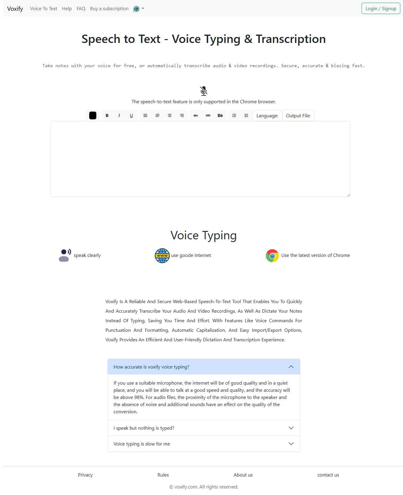
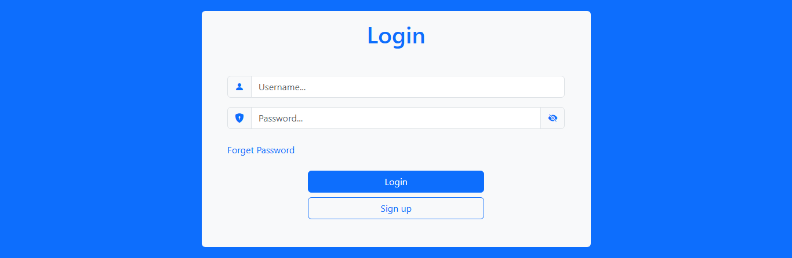

# 🎙️ Voxify

Voxify is a web application that converts **voice recordings into text** in real-time, making transcription fast and easy.

## 🚀 Features
- 🎤 Record and convert voice to text  
- 🔒 Login & Signup system  
- 📄 Download or copy transcribed text  
- 🖥️ Responsive design for desktop and mobile  

## 🖼️ Screenshots
### Homepage


### Login / Signup Page



## 🛠️ Tech Stack
- HTML, CSS, JavaScript  
- Bootstrap

## 📂 Project Structure
voxify/
├── index.html
├── Script.js
├── Style.css
├── 404.html
├── bootstrap-5.3.3-dist/
│ ├── bootstrap.bundle.min.js
│ └── bootstrap.min.css
├── login/
│ ├── login.html
│ ├── login.css
│ └── login.js
├── signup/
│ ├── signup.html
│ ├── signup.css
│ └── signup.js
├── picture/
│ ├── iran-flags.png
│ └── speech-to-text-3d-vector.avif
├── screenshots/
│ ├── voxify.png
│ ├── login.png
│ └── signup.png
└── svg/
└── [all SVG files]


## 📦 Installation & Usage
1. Clone the repository:
   
```bash
   git clone https://github.com/YourUsername/voxify.git
   cd voxify
```
